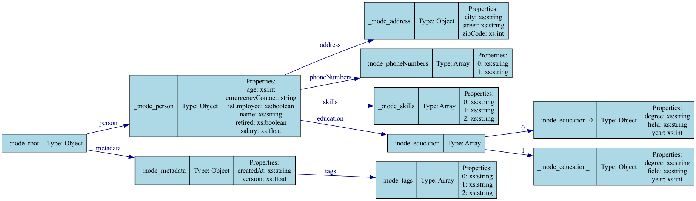

# JSON to RDF Converter

A Python utility for converting JSON files to RDF N-Quad format.

## Features

- Parse JSON files and convert them to RDF triples
- Output RDF data in N-Quad format
- Preserve JSON structure in the resulting RDF graph
- Convert RDF data to GraphViz DOT format

## Installation

1. Clone this repository
2. Install dependencies:
   ```
   pip install -r requirements.txt
   ```

## Usage

```bash
python json_to_rdf.py input.json output.nq
```

Where:
- `input.json` is the path to your JSON file
- `output.nq` is the path where the N-Quad RDF file will be saved

## Example

```bash
python json_to_rdf.py examples/sample.json examples/sample.nq
```

## Convert RDF to GraphViz DOT

```bash
python rdf_to_graphviz.py input.nq output.dot
```

Where:
- `input.nq` is the path to your N-Quad RDF file
- `output.dot` is the path where the GraphViz DOT file will be saved

### Example

```bash
python rdf_to_graphviz.py examples/sample.nq examples/sample.dot
```




## Requirements

- Python 3.6+
- rdflib 6.3.2+
